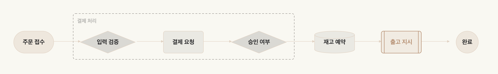
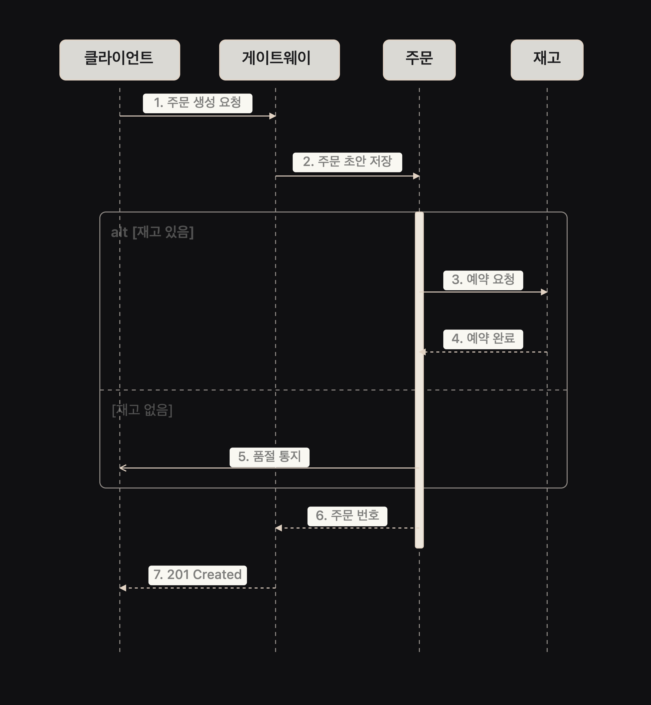
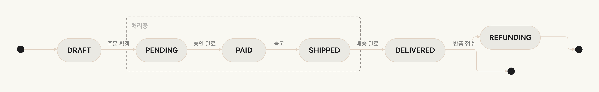
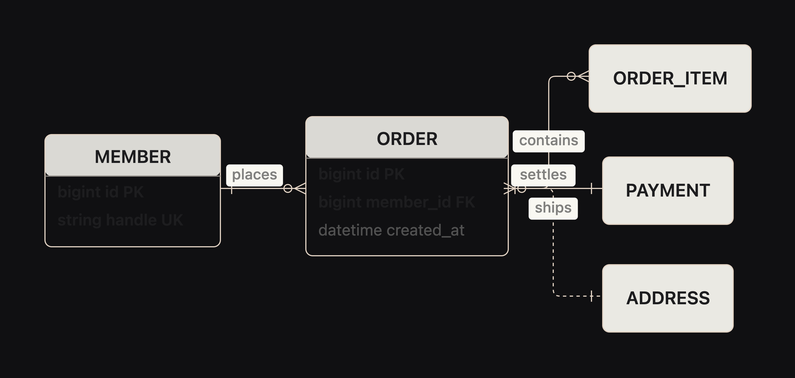
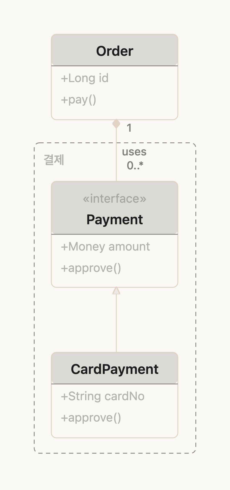
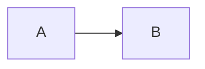

# fencesvg

**Language:** [English](README.md) | [한국어](README.ko.md)

> 마크다운 펜스에 쓴 mermaid 문법을, 사이트 팔레트를 따라가고 sanitizer 를 통과하는 SVG 로 그린다.

[](https://www.npmjs.com/package/fencesvg)
[](LICENSE)
[](#크기)
[](#크기)

<p align="center">
  
</p>

<p align="center">
  <em>이 그림을 위해 쓴 CSS 는 없다. 색은 페이지에서 읽었다.</em>
</p>

> **[Mermaid](https://mermaid.js.org) 프로젝트와 제휴 관계가 없다.** fencesvg 는 mermaid 문법의
> 부분집합을 읽어 독자적으로 그린다 — mermaid 를 번들하지도, 링크하지도, 감싸지도 않는다.
> 무엇이 빠졌는지는 [아직 안 되는 것](#아직-안-되는-것)에 있다.

## 왜 만들었나

마크다운에 다이어그램을 넣는 일은 생각보다 잘 깨진다. 같은 SVG 가 네 지점에서 조용히 죽는다.

| 지점 | 증상 | 결과 |
|---|---|---|
| 마크다운 렌더 | sanitizer 가 `<style>` 과 `<use>` 를 지운다 | 색이 사라진다 |
| 빌드 | 문체 lint 가 596자짜리 SVG 한 줄을 문장으로 읽는다 | 글이 발행되지 않는다 |
| 전송 | 서버 렌더가 raw HTML 을 이스케이프한다 | `&lt;svg viewBox=…` 가 색인되는 본문에 섞인다 |
| 파싱 | CommonMark 가 빈 줄에서 HTML 블록을 끊는다 | 그 아래 속성이 날아간다 |

기존 도구는 예쁜 SVG 를 내준다. 그게 **넣을 수 있는** SVG 인지는 모른다.

fencesvg 는 네 지점을 전부 통과하도록 마크업을 고른다. `<style>` 없음, `<use>` 없음,
한 줄에 요소 하나, 빈 줄 없음, 색은 `var()` 참조, 전부 sanitizer 화이트리스트 안쪽.

## 설치

```bash
npm install fencesvg
```

## 쓰는 법

마크다운 렌더러 앞에 한 줄을 넣는다. DOM 조작도 플레이스홀더도 없다.

```ts
import { inlineDiagrams } from 'fencesvg';

const withDiagrams = inlineDiagrams(source);
const raw = marked.parse(withDiagrams, { async: false, gfm: true });
return DOMPurify.sanitize(raw, { FORBID_TAGS: ['style', 'iframe', 'form', 'input'] });
```

`mermaid`(또는 `diagram`) 로 표시된 펜스만 인라인 SVG 가 되고 나머지는 그대로 둔다.

```ts
import { renderDiagram } from 'fencesvg';

const { svg, caption, warnings } = renderDiagram(source);
```

`renderDiagram` 은 절대 던지지 않는다. 못 읽는 문법이면 `svg: null` 과 이유를 `warnings` 로
돌려주고, `inlineDiagrams` 는 그 펜스를 코드 블록으로 남긴다 — 그림이 사라지는 것보다
원문이 보이는 편이 낫다.

## 다이어그램 종류

### 흐름도

노드 모양 8종, mermaid 연결선 전종, subgraph, 자기 루프, 강조 1종.

```
%% caption: 주문은 결제를 통과해야 출고된다
flowchart LR
  주문([주문 접수]) --> 검증{입력 검증}
  subgraph pay[결제 처리]
    검증 --> 결제[결제 요청]
    결제 --> 승인{승인 여부}
  end
  승인 --> 예약[(재고 예약)]
  예약 --> 출고[[출고 지시]]
  출고 --> 완료((완료))
  class 출고 emphasis
```

| 모양 | 표기 | 모양 | 표기 |
|---|---|---|---|
| 사각형 | `A[라벨]` | 원 | `A((라벨))` |
| 둥근 모서리 | `A(라벨)` | 마름모 | `A{라벨}` |
| 스타디움 | `A([라벨])` | 육각형 | `A{{라벨}}` |
| 서브루틴 | `A[[라벨]]` | 저장소 | `A[(라벨)]` |

| 연결선 | 선 | 끝 |
|---|---|---|
| `-->` `-.->` `==>` | 실선 · 점선 · 굵은선 | 화살표 |
| `---` `-.-` `===` | 실선 · 점선 · 굵은선 | 없음 |
| `--o` `--x` | 실선 | 원 · 가위표 |
| `<-->` | 실선 | 양쪽 |

연결선 길이는 자유다. `---->` 는 `-->` 와 같게 읽는다.

### 순차도

<p align="center">
  
</p>

프레임 블록(`alt` · `else` · `opt` · `loop` · `par` · `critical` · `break`),
활성 구간 상자, `autonumber`, 화살표 끝 4종.

```
%% caption: 주문 생성은 세 시스템을 왕복한다
sequenceDiagram
  autonumber
  participant 클라이언트
  participant 주문
  participant 재고
  클라이언트->>주문: 주문 생성 요청
  activate 주문
  alt 재고 있음
    주문->>재고: 예약 요청
    재고-->>주문: 예약 완료
  else 재고 없음
    주문-)클라이언트: 품절 통지
  end
  deactivate 주문
  주문-->>클라이언트: 201 Created
```

| 끝 | 뜻 | 끝 | 뜻 |
|---|---|---|---|
| `->>` | 화살표 | `-x` | 실패(가위표) |
| `->` | 평선 | `-)` | 비동기(속 빈 화살촉) |

앞에 `--` 를 붙이면 점선이 된다. `-->>`, `--x`.

### 상태도

<p align="center">
  
</p>

중첩 상태는 테두리가 된다. `[*]` 는 나올 때마다 다른 노드다 — 시작과 끝을 한 점으로 합치면
그래프가 순환이 되어 배치가 무너진다.

```
%% caption: 주문 상태는 취소와 환불로 되돌아갈 수 있다
stateDiagram-v2
  [*] --> DRAFT
  DRAFT --> PENDING: 주문 확정
  state 처리중 {
    PENDING --> PAID: 승인 완료
    PAID --> SHIPPED: 출고
  }
  SHIPPED --> DELIVERED: 배송 완료
  DELIVERED --> [*]
```

### ER 다이어그램

<p align="center">
  
</p>

`PK` / `FK` / `UK` 표기와 주석이 붙는 속성 블록. 까마귀발 표기 4종.
`--` 는 식별 관계(실선), `..` 는 비식별(점선).

```
%% caption: 주문 한 건이 여러 항목과 결제를 갖는다
erDiagram
  ORDER {
    bigint id PK
    bigint member_id FK
    datetime created_at
  }
  MEMBER ||--o{ ORDER : places
  ORDER ||--o{ ORDER_ITEM : contains
  ORDER }o..|| ADDRESS : ships
```

### 클래스 다이어그램

<p align="center">
  
</p>

UML 관계 12종, 제네릭(`Repo~T~`), 표식(`<<interface>>`), 개수 표기, `namespace` 테두리.

```
%% caption: 결제 수단은 공통 인터페이스를 구현한다
classDiagram
  namespace 결제 {
    class Payment {
      <<interface>>
      +approve()
    }
    class CardPayment {
      +approve()
    }
  }
  class Order
  Payment <|-- CardPayment
  Order "1" *-- "0..*" Payment : uses
```

| 관계 | 표기 | 관계 | 표기 |
|---|---|---|---|
| 상속 | `<\|--` `--\|>` | 연관 | `-->` `<--` |
| 구현 | `<\|..` `..\|>` | 의존 | `..>` `<..` |
| 합성 | `*--` `--*` | 평선 | `--` `..` |
| 집합 | `o--` `--o` | | |

## 스타일

모든 시각 역할(잉크·선·노드 채움/테두리·강조·라벨)은 CSS 커스텀 프로퍼티(`--fs-*`)이고,
기본값은 SVG 속성 안에 함께 들어간다. 예: `stroke="var(--fs-node-border, currentColor)"`.
설정 파일이 없다. 아무것도 안 주면 기본값으로 그려지고, 자기 스타일시트에서 이름을 정의하면
그쪽이 이긴다.

### 팔레트 자동 감지

브라우저에서는 `renderDiagram`/`inlineDiagrams` 가 페이지의 팔레트를 읽어 `--fs-*` 의
기본값으로 쓴다. 설정도, 지켜야 할 스타일시트 규약도 없다.

CSS 변수 **이름**이 아니라 **칠해진 색**을 읽는다. 이름은 사이트마다 다르다
(`--brand`, `--primary`, `--ko-accent-primary`…). 바탕은 노드 채움으로, 글자색은 잉크로,
테두리 색은 구조선으로, 카드의 `border-radius` 는 모서리 반경으로 간다.

**강조색은 페이지에서 가장 많이 쓰인 유채색이다.** 앞선 두 규칙은 실측에서 무너졌다.
첫 링크의 색을 쓰는 판은, 브랜드색을 본문 링크가 아니라 액션 면에 칠하는 사이트에서 실패했다
— 문서의 첫 링크가 잉크색 로고였고 링크 16개가 전부 무채색이었다. 다음으로 **가장 유채색인**
것을 골랐더니 3px 짜리 장식 인장 점(폭 133, 5회)이 페이지를 지배하는 색(폭 70, 72회)을
이겼다. 사용 횟수로 고르면 호스트가 달라도 같은 답이 나온다. `pre`·`code`·`svg` 는 표본에서
뺀다 — 구문 강조는 본문 내용이지 사이트가 고른 색이 아니고, `svg` 를 읽으면 앞서 그린
다이어그램이 자기 색을 다음 감지에 되먹인다.

대비는 **바탕에 합성한 뒤** 잰다. 사이트가 `color-mix(… 12%, transparent)` 로 만든 테두리
색은 알파를 무시하면 고대비로 보이고, 실제로 칠하면 안 보인다.

감지가 아무것도 못 찾으면 — DOM 이 없거나(Node·SSR), 유채색이 하나도 없는 페이지 —
`EDITORIAL` 로 내려간다. `currentColor` 에서 뽑은 무채색 위계라 어느 바탕에서도 성립하고,
사이트와 부딪힐 수 있는 색을 찍지 않는다. `EDITORIAL` 의 강조는 없는 색 대신 굵기로 읽힌다.

```css
svg {
  --fs-ink: #1a1a1a;
  --fs-line: #6b6b6b;
  --fs-node-border: #1a1a1a;
  --fs-node-fill: rgb(0 0 0 / 4%);
  --fs-node-fill-alt: rgb(0 0 0 / 8%);
  --fs-node-fill-strong: rgb(0 102 204 / 12%);
  --fs-accent: #0066cc;
  --fs-accent-fill: rgb(0 102 204 / 10%);
  --fs-radius: 8; /* 단위 없는 숫자 — SVG rx 는 var() 로 px 를 못 푼다 */
}
```

### 테마 토글

감지는 호출할 때마다 다시 재고, 페이지의 바탕이나 글자색이 실제로 바뀌면 캐시를 버린다.
못 하는 것은 **이미 그려진 SVG 를 다시 칠하는 것**이다 — 마크업은 그릴 때의 색을 그대로
들고 다닌다. `paletteKey()` 를 프레임워크의 memo/effect 의존성 배열에 넣으면, 감지한
팔레트가 바뀔 때 정확히 그때 값이 달라진다.

```javascript
import { inlineDiagrams, paletteKey } from 'fencesvg';

const key = paletteKey(); // 이 값이 바뀌면 inlineDiagrams() 를 다시 부른다
```

### 크기 규칙

크기 상수는 감지한 글자 크기에 비례한다. 본문이 16px 인 사이트는 12px 기준으로 잡힌
상수 대신 그만큼의 여백을 받는다.

각 다이어그램은 스크롤 상자로 감싸고, 고유 폭의 85% 를 `min-width` 로 갖는다. CSS 에서
`min-width` 는 `max-width` 를 이기므로, 다이어그램은 85% 까지만 줄고 그 아래로는 가로
스크롤한다. 하한이 없으면 좁은 열에서 끝없이 줄어들고 글자도 같이 줄어든다 — 본문이
16.3px 인 페이지에서 0.70배, 글자 11.1px 로 측정됐다.

## 크기

gzip **16.6 KB** · 원본 48.3 KB

런타임 의존성 0. 타입 정의 포함.

## 캡션 규칙

펜스의 첫 줄은 `%% caption:` 주석이어야 한다.

````markdown

````

세 곳에 쓰인다. SVG 의 `aria-label`, SVG 를 못 보여줄 때의 대체 텍스트, 그리고 그림 아래
마크다운 캡션 줄 — 마지막 것이 크롤러와 JS 를 실행하지 않는 수집기가 읽는 것이다.
없으면 경고를 남기고 라벨 없이 그린다.

## 표기는 관대하게 받는다

- 화살표 양옆 공백은 있어도 없어도 된다. `A-->B` 와 `A --> B` 가 같다
- id 는 유니코드 글자·숫자·`_`. 하이픈은 못 쓴다 — 무공백 화살표와 구분이 안 된다
- 끝의 세미콜론은 벗긴다. `A --> B;` 가 된다
- 중첩 펜스는 그대로 남아, 글에서 펜스 원문을 코드로 보여줄 수 있다

## 아직 안 되는 것

| 종류 | 없는 것 |
|---|---|
| 순차도 | `rect` 블록(배경색 지정이라 팔레트 모델과 안 맞는다) |
| 배치 | 되돌아가는 간선이 여럿인 순환 흐름도는 잘 안 읽힌다 — 랭크가 뒤집히고 우회 차선이 남의 상자를 스친다 |

그룹 테두리는 구성원의 경계 상자다. 그 안에 구성원이 아닌 노드가 들어가면 테두리를 그리지
않고 경고를 남긴다 — 어떤 노드가 속하지 않은 그룹에 속한다고 말하는 것보다 테두리가 없는
편이 낫다.

못 읽는 문법은 절대 던지지 않는다. 그 펜스는 코드 블록으로 남고 이유가 `warnings` 에 담긴다.

## 라이선스

MIT. © 2026 kgd
