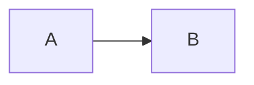

# fencesvg

Render mermaid-syntax fences as SVG that matches your site's design tokens and survives your markdown sanitizer.

## Why this exists

Embedding diagrams in markdown is fragile. The same SVG can be silently destroyed at multiple points:

| Stage | Problem | Outcome |
|-------|---------|---------|
| Markdown rendering | Sanitizer strips `<svg>` | Diagram vanishes |
| Build time | Linter rejects `<svg>` in fence | Markup breaks |
| Transport | Server-side renderer loses SVG | Only text remains |
| Parsing | CommonMark blank-line rule splits fence | Diagram cuts mid-stroke |

This library renders before the markdown parser runs, avoiding all four. The SVG is born inside backticks, where it survives as literal text until the HTML layer.

## Install

```bash
npm install fencesvg
```

## Usage

Call `inlineDiagrams()` before your markdown parser:

```javascript
import { inlineDiagrams } from 'fencesvg';
import { marked } from 'marked';

const text = `
\`\`\`mermaid
%% caption: Workflow
flowchart LR
  A[Start] --> B{Decision}
  B -->|Yes| C[End]
\`\`\`
`;

const withSvg = inlineDiagrams(text);
const html = marked(withSvg); // Safe to pass through any sanitizer
```

The SVG replaces the fence (backticks and all), then a markdown caption line appears below:

```html
<figure>
<svg viewBox="0 0 ...">...</svg>
</figure>

Diagram: Workflow
```

## Diagram types

fencesvg supports five diagram types. Each row shows what works, and what doesn't yet.

### Flowchart

**Supports:**
- Directions: `TD`, `LR`, `BT`, `RL`
- Node shapes: rectangles `[label]`, rounded `(label)`, diamonds `{label}`
- Edges: solid `-->`, dotted `-.->`
- Edge labels: `--> |text|`
- Node emphasis: `class A,B emphasis`
- Chains: `A --> B --> C`
- Unicode IDs: `주문 --> 결제`

**Not yet:**
- `subgraph` clusters

### Sequence

**Supports:**
- Participants (auto-detected from messages)
- Messages: `A->>B` (solid), `A-->>B` (dashed)
- Message labels: `->>|text|`
- Notes: `Note over A: comment`
- Self-messages: `A->>A: loop`

**Not yet:**
- `alt`, `loop`, `opt`, `par` control blocks

### State

**Supports:**
- Syntax: `stateDiagram-v2`
- Transitions with labels: `A --> B: trigger`
- Special markers: `[*]` for start/end
- State emphasis: `class A emphasis`

**Not yet:**
- Nested states: `state A { B --> C }`

### ER (Entity-Relationship)

**Supports:**
- Entity definitions: `ORDER`
- Relationships with labels: `CUSTOMER ||--o{ ORDER : places`
- Crow's-foot cardinalities: `||`, `o{`, `}{`, `|{`

**Not yet:**
- Attribute blocks: `ORDER { int id }`

### Class

**Supports:**
- Class boxes: `class Name`
- Members: `+attr: Type`, `-method()`
- Relations: `<|--` (extend), `*--` (compose), `o--` (aggregate), `-->` (link)

**Not yet:**
- Namespaces: `namespace n { class A }`

## Styling

Every visual role — ink, lines, node fill/border, accent, labels — is a CSS custom
property (`--fs-*`) with a fallback baked into the SVG attribute itself, e.g.
`stroke="var(--fs-node-border, currentColor)"`. There is no config file: set none of
them and diagrams render close to today's look off the fallbacks; set any of them in
your own stylesheet and the diagram inherits your site's materials. CSS always wins
over the fallback.

### Automatic palette detection

In a browser, `renderDiagram`/`inlineDiagrams` read the host page's own palette and
use it as the `--fs-*` fallbacks — zero configuration, no stylesheet convention to
write. It samples the page (not CSS variable names, which differ on every site):
background for the node fill, text colour for ink, the first link's colour for the
accent, a border colour for structure, a caption/secondary colour for muted text, and
a card's `border-radius`. An explicit `accent` option, or your own `--fs-*` rule,
always wins over what was detected.

When detection finds nothing usable — no DOM (Node/SSR), or a page with no links to
carry a brand colour — diagrams fall back to `EDITORIAL`, the library's default look:
a monochrome, `currentColor`-derived hierarchy that works on any background without
guessing a hue that might clash with the site. Emphasis in `EDITORIAL` reads through
weight (a heavier border and bolder label) instead of a colour it doesn't have.

```css
svg {
  --fs-ink: #1a1a1a;
  --fs-line: #6b6b6b;
  --fs-node-border: #1a1a1a;
  --fs-node-fill: rgb(0 0 0 / 4%);
  --fs-accent: #0066cc;
  --fs-accent-fill: rgb(0 102 204 / 10%);
  --fs-radius: 8; /* unitless number — SVG rx doesn't resolve px through var() */
}
@media (prefers-color-scheme: dark) {
  svg {
    --fs-ink: #eee;
    --fs-line: #9a9a9a;
    --fs-node-border: #eee;
    --fs-accent: #0099ff;
  }
}
```

`accent` passed to `renderDiagram`/`inlineDiagrams` (or `defaultTheme(accent)`)
becomes the fallback for `--fs-accent` — useful when you don't want a global
stylesheet rule, but `--fs-accent` set in CSS still wins over it.

## Size

Gzipped bundle: **8.6 KB**  
Raw: 25.7 KB

Zero runtime dependencies. TypeScript types included.

## Caption rule

The first line of a mermaid fence must be a `%% caption:` comment:

````markdown

````

This is required for three reasons:

1. **Accessibility**: becomes the `aria-label` on the SVG
2. **Fallback text**: if SVG fails to load, the caption is shown
3. **Markdown caption line**: placed below the diagram as context

Without it, the library emits a warning and renders the diagram with no label.

## Other tolerances

- Arrows can be unspaced: `A-->B` works like `A --> B`
- IDs accept unicode letters, digits, and underscore. Hyphens are not allowed (they are ambiguous with unspaced arrows)
- Trailing semicolons are stripped: `A --> B;` is valid
- Nested mermaid fences stay literal, so a post can show fence source as code:
  ````markdown
  Here's how to write a flowchart:
  
  ```mermaid
  %% caption: Example
  flowchart LR
    A --> B
  ```
  ````

## License

MIT. © 2026 kgd
