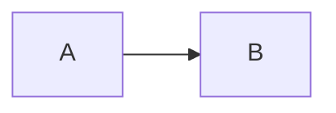

# fencesvg

**Language:** [English](README.md) | [한국어](README.ko.md)

> Render mermaid-syntax fences as SVG that adopts your site's palette and survives your markdown sanitizer.

[](https://www.npmjs.com/package/fencesvg)
[](LICENSE)
[](#size)
[](#size)

<p align="center">
  
</p>

<p align="center">
  <em>No stylesheet was written for this. The colours came from the page.</em>
</p>

> **Not affiliated with the [Mermaid](https://mermaid.js.org) project.** fencesvg reads a
> subset of mermaid syntax and draws it independently — it does not bundle, link to, or
> wrap mermaid. See [Not supported](#not-supported) for what the subset leaves out.

## Why this exists

Embedding diagrams in markdown is fragile. The same SVG can be silently destroyed at multiple points:

| Stage | Problem | Outcome |
|-------|---------|---------|
| Markdown rendering | Sanitizer strips `<style>` and `<use>` | Diagram loses its colours |
| Build time | Prose linter reads a 596-char SVG line as a sentence | The post can't be published |
| Transport | Server-side renderer escapes raw HTML | `&lt;svg viewBox=…` lands in the indexed body |
| Parsing | CommonMark blank-line rule ends the HTML block | Attributes after the blank line are dropped |

Existing tools produce a pretty SVG. They don't know whether it is an SVG you can *ship*.

fencesvg emits markup chosen to pass all four: no `<style>`, no `<use>`, one element per
line, no blank lines, colours as `var()` references, and the whole thing on the near side
of a sanitizer allowlist.

## Install

```bash
npm install fencesvg
```

## Usage

Put one line in front of your markdown renderer. No DOM manipulation, no placeholders:

```ts
import { inlineDiagrams } from 'fencesvg';

const withDiagrams = inlineDiagrams(source);
const raw = marked.parse(withDiagrams, { async: false, gfm: true });
return DOMPurify.sanitize(raw, { FORBID_TAGS: ['style', 'iframe', 'form', 'input'] });
```

Fences tagged `mermaid` (or `diagram`) become inline SVG. Everything else is untouched.

```ts
import { renderDiagram } from 'fencesvg';

const { svg, caption, warnings } = renderDiagram(source);
```

`renderDiagram` never throws. On unreadable syntax it returns `svg: null` and an
explanation in `warnings`, and `inlineDiagrams` leaves that fence as a code block —
seeing the source beats seeing nothing.

## Diagram types

### Flowchart

Eight node shapes, every mermaid connector, subgraphs, self-loops, and one emphasis node.

```
%% caption: 주문은 결제를 통과해야 출고된다
flowchart LR
  주문([주문 접수]) --> 검증{입력 검증}
  subgraph pay[결제 처리]
    검증 --> 결제[결제 요청]
    결제 --> 승인{승인 여부}
  end
  승인 --> 예약[(재고 예약)]
  예약 --> 출고[[출고 지시]]
  출고 --> 완료((완료))
  class 출고 emphasis
```

| Shape | Syntax | Shape | Syntax |
|---|---|---|---|
| Rectangle | `A[label]` | Circle | `A((label))` |
| Rounded | `A(label)` | Diamond | `A{label}` |
| Stadium | `A([label])` | Hexagon | `A{{label}}` |
| Subroutine | `A[[label]]` | Cylinder | `A[(label)]` |

| Connector | Line | Head |
|---|---|---|
| `-->` `-.->` `==>` | solid · dotted · thick | arrow |
| `---` `-.-` `===` | solid · dotted · thick | none |
| `--o` `--x` | solid | circle · cross |
| `<-->` | solid | both ends |

Connector length is free: `---->` reads the same as `-->`.

### Sequence

<p align="center">
  
</p>

Frame blocks (`alt` · `else` · `opt` · `loop` · `par` · `critical` · `break`),
activation bars, `autonumber`, and four arrow ends.

```
%% caption: 주문 생성은 세 시스템을 왕복한다
sequenceDiagram
  autonumber
  participant 클라이언트
  participant 주문
  participant 재고
  클라이언트->>주문: 주문 생성 요청
  activate 주문
  alt 재고 있음
    주문->>재고: 예약 요청
    재고-->>주문: 예약 완료
  else 재고 없음
    주문-)클라이언트: 품절 통지
  end
  deactivate 주문
  주문-->>클라이언트: 201 Created
```

| End | Meaning | End | Meaning |
|---|---|---|---|
| `->>` | arrow | `-x` | failure (cross) |
| `->` | plain line | `-)` | async (open arrow) |

A leading `--` makes any of them dotted: `-->>`, `--x`.

### State

<p align="center">
  
</p>

Nested states become frames. `[*]` is a distinct node every time it appears — merging start
and end into one node would turn the graph into a cycle and break the layout.

```
%% caption: 주문 상태는 취소와 환불로 되돌아갈 수 있다
stateDiagram-v2
  [*] --> DRAFT
  DRAFT --> PENDING: 주문 확정
  state 처리중 {
    PENDING --> PAID: 승인 완료
    PAID --> SHIPPED: 출고
  }
  SHIPPED --> DELIVERED: 배송 완료
  DELIVERED --> [*]
```

### ER (Entity-Relationship)

<p align="center">
  
</p>

Attribute blocks with `PK` / `FK` / `UK` markers and comments. Crow's-foot notation in
four cardinalities. `--` is an identifying relationship (solid), `..` non-identifying
(dotted).

```
%% caption: 주문 한 건이 여러 항목과 결제를 갖는다
erDiagram
  ORDER {
    bigint id PK
    bigint member_id FK
    datetime created_at
  }
  MEMBER ||--o{ ORDER : places
  ORDER ||--o{ ORDER_ITEM : contains
  ORDER }o..|| ADDRESS : ships
```

### Class

<p align="center">
  
</p>

Twelve UML relations, generics (`Repo~T~`), stereotypes (`<<interface>>`), cardinality
labels, and `namespace` frames.

```
%% caption: 결제 수단은 공통 인터페이스를 구현한다
classDiagram
  namespace 결제 {
    class Payment {
      <<interface>>
      +approve()
    }
    class CardPayment {
      +approve()
    }
  }
  class Order
  Payment <|-- CardPayment
  Order "1" *-- "0..*" Payment : uses
```

| Relation | Syntax | Relation | Syntax |
|---|---|---|---|
| Inheritance | `<\|--` `--\|>` | Association | `-->` `<--` |
| Realization | `<\|..` `..\|>` | Dependency | `..>` `<..` |
| Composition | `*--` `--*` | Link | `--` `..` |
| Aggregation | `o--` `--o` | | |

## Styling

Every visual role — ink, lines, node fill/border, accent, labels — is a CSS custom
property (`--fs-*`) with a fallback baked into the SVG attribute itself, e.g.
`stroke="var(--fs-node-border, currentColor)"`. There is no config file: set none of
them and diagrams render off the fallbacks; set any of them in your own stylesheet and
the diagram inherits your site's materials. CSS always wins over the fallback.

### Automatic palette detection

In a browser, `renderDiagram`/`inlineDiagrams` read the host page's own palette and use
it as the `--fs-*` fallbacks — zero configuration, no stylesheet convention to write.

It samples painted colours, not CSS variable names, because names differ on every site
(`--brand`, `--primary`, `--ko-accent-primary`…). Background becomes node fill, text
colour becomes ink, a border colour becomes structure, a card's `border-radius` becomes
the corner radius.

**The accent is the most-used chromatic colour on the page.** Two earlier rules failed in
measurement. Taking the first link's colour failed on a site that paints its brand colour
on action surfaces, not text links — the document's first link was an ink-coloured logo
and all 16 links were achromatic. Taking the *most saturated* colour then let a 3px
decorative seal dot (chroma 133, 5 uses) beat the colour that actually dominates the page
(chroma 70, 72 uses). Counting usage gives the same answer across hosts. `pre`, `code`,
and `svg` are excluded — syntax highlighting is content, not a design choice, and reading
`svg` would feed a previously drawn diagram's colours back into the next detection.

Contrast is measured **after compositing onto the background**. A border colour a site
built with `color-mix(… 12%, transparent)` looks high-contrast if you ignore alpha, and
invisible once painted.

When detection finds nothing usable — no DOM (Node/SSR), or a page with no chromatic
colour — diagrams fall back to `EDITORIAL`: a monochrome, `currentColor`-derived
hierarchy that works on any background without guessing a hue that might clash. Emphasis
in `EDITORIAL` reads through weight instead of a colour it doesn't have.

```css
svg {
  --fs-ink: #1a1a1a;
  --fs-line: #6b6b6b;
  --fs-node-border: #1a1a1a;
  --fs-node-fill: rgb(0 0 0 / 4%);
  --fs-node-fill-alt: rgb(0 0 0 / 8%);
  --fs-node-fill-strong: rgb(0 102 204 / 12%);
  --fs-accent: #0066cc;
  --fs-accent-fill: rgb(0 102 204 / 10%);
  --fs-radius: 8; /* unitless number — SVG rx doesn't resolve px through var() */
}
```

### Theme toggles

Detection re-samples on every call and replaces its cached result once the page's
background or text colour changes. What it cannot do is redraw an SVG that already
exists — the markup carries the colours it was drawn with. Put `paletteKey()` in your
framework's memo/effect dependency list; it changes exactly when the detected palette
does:

```javascript
import { inlineDiagrams, paletteKey } from 'fencesvg';

const key = paletteKey(); // re-run inlineDiagrams() whenever this changes
```

### Sizing

Sizes scale with the detected font size, so a 16px site gets proportional padding rather
than constants tuned for 12px.

Each diagram is wrapped in a scroll container and carries `min-width` at 85% of its
intrinsic width. `min-width` beats `max-width` in CSS, so a diagram shrinks to fit down
to 85% and then scrolls horizontally instead of shrinking further. Without the floor,
a wide diagram in a narrow column shrinks without limit and its text goes with it —
measured at 0.70× and 11.1px on a page whose body text is 16.3px.

## Size

Gzipped bundle: **16.6 KB** · Raw: 48.3 KB

Zero runtime dependencies. TypeScript types included.

## Caption rule

The first line of a fence must be a `%% caption:` comment:

````markdown

````

It is used three times: as the SVG's `aria-label`, as the fallback text when the SVG
can't be shown, and as a markdown caption line below the diagram — the last one is what
crawlers and non-JS readers get. Without it the library emits a warning and draws the
diagram unlabelled.

## Other tolerances

- Arrows can be unspaced: `A-->B` works like `A --> B`
- IDs accept unicode letters, digits, and underscore. Hyphens are not allowed — they are ambiguous with unspaced arrows
- Trailing semicolons are stripped: `A --> B;` is valid
- Nested fences stay literal, so a post can show fence source as code

## Not supported

| Type | Missing |
|---|---|
| sequence | `rect` blocks (background colour, which conflicts with the palette model) |
| layout | Cyclic flowcharts with several back-edges read poorly — the rank assignment inverts and detour lanes graze unrelated boxes |

Group frames are the bounding box of their members. If a non-member ends up inside that
box, the frame is dropped and a warning is emitted rather than drawn — claiming a node
belongs to a group it doesn't is worse than no frame.

Unreadable syntax never throws: the fence stays a code block and the reason lands in
`warnings`.

## License

MIT. © 2026 kgd
